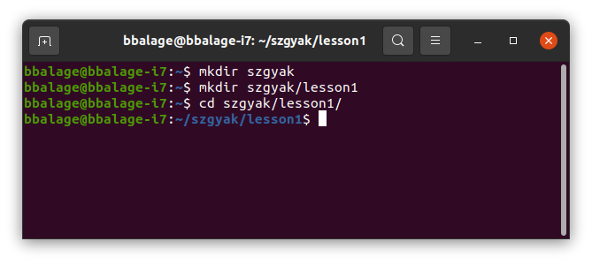
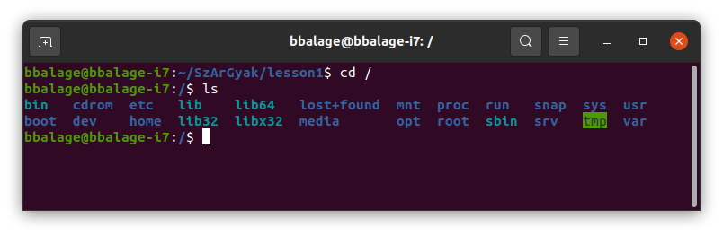

# 1. óra

## Elméleti információk
---

Számítógépes Architektúrák gyakorlatokon shell scriptek írásával fogunk foglalkozni Unix
alapú operációs rendszerekben. Mit tekintünk Unix alapú rendszernek, és mik is azok a 
shell scriptek?

Az eredeti AT&T Unix operációs rendszert még a hatvanas években fejlesztették, és sok 
későbbi operációs rendszernek szolgált alapjául. Ezeknek egy része tényleges Unix 
operációs rendszer (Solaris), mások pedig Unixhoz hasonló rendszerek: Mac OS X és a
számtalan Linux disztribúció.

Az informatikus tanulmányok során érdemes megismerkedni legalább egy Linux 
operációs rendszerrel közelebbről (tehát érdemes saját otthoni gépre is 
feltelepíteni, akár virtuális gépen).
A tanszéki gépeken ennek a jegyzetnek az írásakor Linux Mint van telepítve
(a Mint egy Linux disztribúció). Ezen felül a következő Linux disztribúciókat
érdemes megemlíteni:
- **Ubuntu.** A Linux Mintnél mostanra elterjedtebbé váltak a
különböző Ubuntu verziók (Ubuntu 18.04, 20.04, 22.04; a verziók a kiadásuk éve 
szerint vannak számozva). Könnyen installálható, felhasználóbarát. Otthoni gyakorláshoz
tökéletes.
- **Arch Linux.** Arról híres, hogy annyira minimalista, hogy a felhasználónak
gyakorlatilag mindent nem létfontosságú dolgot magának kell telepítenie.
- **Manjaro Linux.** Az Arch Linuxon alapul, csak igyekeztek "felhasználóbarátabbá"
tenni.
- **Kali Linux.** Digitális analizálásra és sebezhetőség tesztelésre specializálódott
Linux.

A shell kezelésének szempontjából nem lényeges, hogy melyik Linux operációs rendszert 
használjuk. De mi az a shell?

Az operációs rendszerek központi eleme a **kernel** (tehát mag). A *kernel* felelős
az alapvető funkciók ellátásáért (például processzek kezelése, memória menedzselés,
fájlrendszeri művelet; ezekről bővebben Operációs Rendszerek tárgyból). A *shell* (héj)
egy parancsértelmező, ami a felhasználó szöveges utasításait fogja a kernel számára is 
értelmezhető utasításokká alakítani.

Tehát a shellt mi úgy fogjuk látni, mint egy terminálban futó parancsértelmezőt. Az alább
látható képen egy terminál látható, amiben egy shell fut.



A fönt látható terminálban a **Bash** parancsértelmező fut, a parancsok pedig létrehoznak 
két mappát; SzArGyak (Számítógépes Architektúrák Gyakorlat) és benne a lesson1 mappát, majd 
belépnek a lesson1 mappába. Egy terminálban futhat másféle shell is, nem csak Bash
(más shellek például: sh, zsh). A Windows operációs rendszereknek is van shellje, csak ott Powershellként és Command Line-ként találkozhatunk velük. Ezeknek más a szintaktikája, mint
a Bash-nek. Mi a gyakorlatok keretében Bash scripteket fogunk írni.

**Bash:** az elnevezés egy szójátékból adódik. A mostani shell szabvány az eredeti AT&T Unixhoz
tartozó shell szabványból indul ki, amelyet Stephen Bourne dolgozott ki. Bash = **B**ourne
**A**gain **Sh**ell.

A Linux alapú rendszereknek az egyik nagy erőssége, hogy rengeteg előre elkészített "paranccsal" rendelkeznek (kb. 700-1000). A parancsokat más néven "eszközöknek" (tool) nevezik, elvégre ezek
többsége külső segédprogram. Néhány példát említve, hogy mire alkalmasak a parancsok:

- `cd` – egy másik mappába való belépésre szolgáló parancs
- `mkdir` – mappa létrehozására szolgáló parancs
- `wc` – szavak, sorok és karakterek számlálására szolgáló parancs
- `grep` – adott szöveges mintára illeszkedő sorok kiválasztása
- stb.

A későbbiekben feladatokon keresztül fogunk megismerkedni az ilyen parancsokkal, és ezeknek a 
használatával. A parancsok egymással kombinálhatók, és általuk komplex feladatok hajthatók végre.

Legelőször nyissunk egy terminált (Ctrl + Alt + T), amiben bash fut (feltehetően 
ez a default). Mindent terminálban fogunk csinálni.

## Példák
---

## 1. feladat
Hozzunk létre egy mappát, amit a gyakorlatok feladataihoz fogunk használni.
A neve legyen például `SzArGyak`. Ebben a mappában hozzunk létre egy másikat,
aminek neve legyen `lesson1`. Lépjünk bele ebbe a mappába!

A következő parancsokkal például ez megvalósítható:

```bash
mkdir SzArGyak
mkdir SzArGyak/lesson1
cd SzArGyak/lesson1
```

A fönti példában a következőket figyeljük meg:
- 3 db parancsot adtunk ki, köztünk entert ütöttünk, tehát a parancsokat egyesével
adtuk ki. Ebből következtethetünk, hogy a bash, mint parancssori shell script egy 
interpreteres nyelv (tehát egyesével, soronként hajtja végre a parancsainkat).
- A parancsoknál az első szó a **parancs neve**, utána pedig a paraméterek. Általánosan
`command_name command_argument_1 command_argument_2 command_argument_n` formában van
egy egyszerű parancs. Az argumentumokat (vagy paramétereket) szóközök választják el 
egymástól és a parancs nevétől. Ez némileg értelmet ad annak a definciónak, hogy
*"a parancs fehér karakterekkel határolt szavak sora*".
- A parancsok nevei valami értelmes szópárosnak a rövidítése. `mkdir` = make directory = 
mappa (vagy szakmaiasabban jegyzék) létrehozása. `cd` = change directory = jegyzék 
megváltoztatása, vagy talán inkább *jegyzékváltás*.
- A parancssorban látjuk, hogy milyen jegyzékben tartózkodunk éppen. Az alábbi kép 
ezt szemlélteti.


Ezzel kapcsolatban az is megfigyelhető, hogy a mappaneveket `/` (slash) jel választja
el egymástól. Ez Unix alapú rendszereknél így van, míg Windowsban ez a jel `\`
(backslash).

Egyébként arra, hogy megtudjuk milyen jegyzékben vagyunk, használhatjuk a `pwd`
parancsot is (print working directory). Ez kiírja az aktuális mappát (working directory),
mely, mint azt elvileg tanuljuk előadáson, egy kitüntetett jegyzék, amit tárol a rendszer.
Üssük be a parancsot!

```bash
pwd
# valami ilyesmit kell kapnunk: /home/bbalage/SzArGyak/lesson1
# By the way: hashmark (#) kommentet jelent bashben
# Tehát amit # után írsz, azt a parancssor nem fogja értelmezni
```

A kapott output eleje nem egyezik azzal, amit a terminálban olvashatunk. Ha megfigyeljük,
akkor a `~` jel felcserélődött egy másik "ösvénnyel" (továbbiakban *path*). A `~` jel
egy rövidítés a saját felhasználói gyökér mappánkra. Nálam a `~` jelentése `/home/bbalage`,
míg más felhasználóknál ez más lesz.

Szintén megemlítendő, hogy Unix rendszerben a tényleges gyökérmappát a `/` jel azonosítja.
Lépjünk bele, és írassuk ki a tartalmát! Hint: az `ls` parancs kiírja egy jegyzék tartalmát
(ha nem adunk meg neki jegyzéket, akkor a working directory tartalmát írja ki).

```bash
cd /
ls
```

A kép szemlélteti, hogy mit fogunk kapni:



Amiket látunk, azok rendszermappák. A felhasználói fiókok a `home` mappában lesznek. Nézzünk
szét itt is:

```bash
cd home
ls
```

Most valószínűleg megtudtuk, kik lakoznak a rendszeren rajtunk kívül (az iskolai rendszereken
valószínűleg nem közvetlenül a `home` mappában találjuk a felhasználói fiókokat, hanem további
almappákra vannak osztva a tanulók, oktatók, stb.).

Most már felderítő útra indulhatnánk, de előbb tanuljunk meg még egy-két dolgot a parancsokról
és az Unix mappaszerkezetről!

### A `man` parancs

A `man` parancs megmutatja nekünk egy parancs *manual page* bejegyzését. Próbáljuk ki
valamelyik eddig használt parancsra!

```bash
man cd
```

A megjelenő szöveg a felhasználói útmutató az adott parancshoz. Itt esélyesen rengeteg dolog
fel van sorolva: parancsleírás, kapcsolók, paraméterek, stb. A nyilakkal tudunk lejjebb vagy
feljebb görgetni, míg a `q` billentyű lenyomásával tudunk kilépni a *manual page* bejegyzésből.

### Kapcsolók

Egy parancs működését lehet módosítani kapcsolók segítségével. Egy kapcsoló a parancs után jön
(az argumentumok közötti elhelyezkedése változhat parancsonként és kapcsolónként).

Próbáljuk ki az `ls` parancs kapcsolóit! Először lépjünk vissza a felhasználói gyökér
jegyzékünkbe:

```bash
cd ~ # ~ a felhasználói gyökérmappád rövidítése, például /home/students2022/gazsi1
ls -l # kötőjellel adjuk meg a kapcsolókat
ls -a # ez egy másik kapcsoló
ls -la # ez a két előző kapcsoló kombinálva
```

Azt, hogy az `ls` parancs működése hogyan változik meg a kapcsolók miatt, megtudhatjuk a 
manuálból (`man ls`). Röviden:

- Az `l` kapcsoló bővebb adatokat jelenít meg a fájlokról és mappákról, nem csak a nevüket.
- Az `a` kapcsoló olyan mappákat is megjelenít, amik `.` jellel kezdődnek, vagy épp csak abból állnak.
- Az `la` kapcsoló a kettő kombinációja: bővebb adat, és ponttal kezdődő nevek is.

A ponttal kezdődő nevek valamilyen kisegítő dologhoz szoktak tartozni, amit nem szeretnénk,
hogy az a felhasználó is lásson, aki csak kattintgat egy *file explorer* felületen. Ezek 
lehetnek parancssori fájlok, konfigurációk, de gyakorlatilag bármi más is, aminek úgy 
döntöttünk, hogy ponttal kezdődő nevet adtunk.

Lépjünk be `lesson1` jegyzékbe, és figyeljük meg, hogy a jegyzék nem üres!

```bash
cd SzArGyak/lesson1
ls -la
```

Még az üres jegyzéknek is van két bejegyzése: `.` és `..`
Az egy pontból álló bejegyzés magára a jegyzékre mutat, míg a két pontból álló bejegyzés 
a szülő jegyzékre (amiben az aktuális jegyzék van). Tehát a következő paranccsal visszalépünk
a `SzArGyak` jegyzékbe:

```bash
cd ..
```

Még egy megjegyzés: az `ls` parancs segítségével úgy is meg tudjuk nézni egy mappa tartalmát,
hogy nem lépünk bele. Ehhez csak át kell adnunk a mappa elérési útvonalát. Például:

```bash
ls -la /home # például így
ls -l .. # vagy így
ls ../.. # vagy akár így is
```

Az elérési útvonalak lehetnek relatívak vagy abszolútak. A relatív útvonal az aktuális 
*working directory*-tól indít, míg az abszolút a gyökértől, tehát `/`-től.

Kérdés: melyik abszolút és melyik relatív?

```bash
cd /home/bbalage/Documents
mkdir SzArGyak
ls ..
cd ~/Pictures
```

## 2. feladat (önálló)
Töröljük a létrehozott `SzArGyak` és `lesson1` mappákat az `rmdir` (= remove directory)
paranccsal, utána hozzuk létre ismét, de ezúttal egyetlen parancskiadással. Hint:
a `mkdir` manuáljában van a megoldás módja (egy kapcsoló kell), de az internet is nagyon
sokat segíthet a megoldásban.