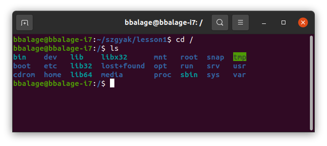

# 1. óra

## Háttérismeretek
---

Számítógépes Architektúrák gyakorlatokon shell scriptek írásával fogunk foglalkozni Unix
alapú operációs rendszerekben. Mit tekintünk Unix alapú rendszernek, és mik is azok a 
shell scriptek?

Az eredeti AT&T Unix operációs rendszert még a hatvanas években fejlesztették, és sok 
későbbi operációs rendszernek szolgált alapjául. Ezeknek egy része tényleges Unix 
operációs rendszer (Solaris), mások pedig Unixhoz hasonló rendszerek: Mac OS X és a
számtalan Linux disztribúció.

Az informatikus tanulmányok során érdemes megismerkedni legalább egy Linux 
operációs rendszerrel közelebbről (tehát érdemes saját otthoni gépre is 
feltelepíteni, akár virtuális gépen).
A tanszéki gépeken ennek a jegyzetnek az írásakor Linux Mint van telepítve
(a Mint egy Linux disztribúció). Ezen felül a következő Linux disztribúciókat
érdemes megemlíteni:
- **Ubuntu.** A Linux Mintnél mostanra elterjedtebbé váltak a
különböző Ubuntu verziók (Ubuntu 18.04, 20.04, 22.04; a verziók a kiadásuk éve 
szerint vannak számozva). Könnyen installálható, felhasználóbarát. Otthoni gyakorláshoz
tökéletes.
- **Arch Linux.** Arról híres, hogy annyira minimalista, hogy a felhasználónak
gyakorlatilag mindent nem létfontosságú dolgot magának kell telepítenie.
- **Manjaro Linux.** Az Arch Linuxon alapul, csak igyekeztek "felhasználóbarátabbá"
tenni.
- **Kali Linux.** Digitális analizálásra és sebezhetőség tesztelésre specializálódott
Linux.

A shell kezelésének szempontjából nem lényeges, hogy melyik Linux operációs rendszert 
használjuk. De mi az a shell?

Az operációs rendszerek központi eleme a **kernel** (tehát mag). A *kernel* felelős
az alapvető funkciók ellátásáért (például processzek kezelése, memória menedzselés,
fájlrendszeri művelet; ezekről bővebben Operációs Rendszerek tárgyból). A *shell* (héj)
egy parancsértelmező, ami a felhasználó szöveges utasításait fogja a kernel számára is 
értelmezhető utasításokká alakítani.

Tehát a shellt mi úgy fogjuk látni, mint egy terminálban futó parancsértelmezőt. Az alább
látható képen egy terminál látható, amiben egy shell fut.


A fönt látható terminálban a **Bash** parancsértelmező fut, a parancsok pedig létrehoznak 
két mappát; SzArGyak (Számítógépes Architektúrák Gyakorlat) és benne a lesson1 mappát, majd 
belépnek a lesson1 mappába. Egy terminálban futhat másféle shell is, nem csak Bash
(más shellek például: sh, zsh). A Windows operációs rendszereknek is van shellje, csak ott Powershellként és Command Line-ként találkozhatunk velük. Ezeknek más a szintaktikája, mint
a Bash-nek. Mi a gyakorlatok keretében Bash scripteket fogunk írni.

**Bash:** az elnevezés egy szójátékból adódik. A mostani shell szabvány az eredeti AT&T Unixhoz
tartozó shell szabványból indul ki, amelyet Stephen Bourne dolgozott ki. Bash = **B**ourne
**A**gain **Sh**ell.

A Linux alapú rendszereknek az egyik nagy erőssége, hogy rengeteg előre elkészített "paranccsal" rendelkeznek (kb. 700-1000). A parancsokat más néven "eszközöknek" (tool) nevezik, elvégre ezek
többsége külső segédprogram. Néhány példát említve, hogy mire alkalmasak a parancsok:

- `cd` – egy másik mappába való belépésre szolgáló parancs
- `mkdir` – mappa létrehozására szolgáló parancs
- `wc` – szavak, sorok és karakterek számlálására szolgáló parancs
- `grep` – adott szöveges mintára illeszkedő sorok kiválasztása
- stb.

A későbbiekben feladatokon keresztül fogunk megismerkedni az ilyen parancsokkal, és ezeknek a 
használatával. A parancsok egymással kombinálhatók, és általuk komplex feladatok hajthatók végre.

Legelőször nyissunk egy terminált (Ctrl + Alt + T), amiben bash fut (feltehetően 
ez a default). A további feladatokat terminálban fogjuk csinálni.

## Példák
---

### 1. példa
Hozzunk létre egy mappát, amit a gyakorlatok feladataihoz fogunk használni.
A neve legyen `szgyak`. Ebben a mappában hozzunk létre egy másikat, aminek neve
legyen `lesson1`. Lépjünk bele ebbe a mappába!

A következő parancsokkal például ez megvalósítható:

```bash
mkdir szgyak
mkdir szgyak/lesson1
cd szgyak/lesson1
```

A fönti példában a következőket figyeljük meg:
- 3 db parancsot adtunk ki, köztünk entert ütöttünk, tehát a parancsokat egyesével
adtuk ki. A parancsokat a shell soronként értelmezte, tehát a shell egy interpreter. 
- A parancsoknál az első szó a **parancs neve**, a további szavak az **argumentumok**.
Általánosan egy egyszerű parancs formája:
`command_name command_argument_1 command_argument_2 command_argument_n`
Az argumentumokat szóközök választják el egymástól és a parancs nevétől. Ez némileg értelmet
ad annak a definciónak az elméleti tananyagban, hogy
*"a parancs fehér karakterekkel határolt szavak sora*".
- A parancsok nevei általában valami értelmes szópárosnak a rövidítései.
`mkdir` = make directory = mappa (vagy szakmaiasabban jegyzék) létrehozása.
`cd` = change directory = jegyzék megváltoztatása, vagy *jegyzékváltás*.
- A parancssorban látjuk, hogy milyen jegyzékben tartózkodunk éppen.

Ezzel kapcsolatban az is megfigyelhető, hogy a mappaneveket `/` (slash) jel választja
el egymástól. Ez Unix alapú rendszereknél így van, míg Windowsban ez a jel `\`
(backslash).

### 2. példa

Írjuk ki, hogy hol tartózkodunk épp a mapparendszerben, az abszolút ösvénnyel!

Erre használhatjuk a `pwd` parancsot is (print working directory). Ez kiírja az aktuális
mappát (working directory).

Üssük be a parancsot!

```bash
pwd
# valami ilyesmit kell kapnunk: /home/bbalage/szgyak/lesson1
# A hashmark (#) kommentet jelent bashben
# Tehát amit # után írsz, azt a parancssor nem fogja értelmezni
```

A kapott output eleje nem egyezik azzal, amit a terminálban olvashatunk. Ha megfigyeljük,
akkor a `~` jel felcserélődött egy másik "ösvénnyel"
(továbbiakban  az "ösvényre" *path*-ként fogok hivatkozni). A `~` jel
egy rövidítés a saját felhasználói gyökér mappánkra. Nálam a `~` jelentése `/home/bbalage`,
míg más felhasználóknál ez más lesz.

Szintén megemlítendő, hogy Unix rendszerben a tényleges gyökérmappát a `/` jel azonosítja.
**Ha a gyökérből kiindulva adjuk meg a path-t, akkor a "full path-t" adjuk meg.** Ellenben,
**ha a jelenlegi jegyzékből (working directory) indulunk ki, akkor a "relative path-t"
(relatív ösvény).**

### 3. példa

Lépjünk be a gyökér mappába, és írassuk ki a tartalmát!

Egy mappa kiírására az `ls` parancsot tudjuk használni. Az `ls` parancsnak opcionálisan
megadhatjuk, hogy melyik jegyzék tartalmát írja ki. Ha nem adunk meg semmit, akkor a 
working directory tartalmát írja ki.


```bash
cd /
ls
# Ha nem akarunk belépni a mappába, csak ki akarjuk írni a tartalmát, akkor
# ezt az alábbi paranccsal egy lépésben is megtehetjük:
ls /
```

A kép szemlélteti, hogy mit fogunk kapni:



Amiket látunk, azok rendszermappák. Csak néhányat kiemelve ezek közül:
- `bin`: a bináris állományok, tehát a programok találhatók itt. A félévben használt 
programok közül sokat megtalálunk ebben a mappában. Az eddigiek közül a `mkdir`, a `pwd`
és az `ls` parancs is itt van, de a `cd` parancs nincs, ugyanis a `cd` parancs magában
a `bash` parancsértelmezőben van implementálva (része a nyelvnek), míg a többiek külső
segédprogramok. Ezért mondjuk azt, hogy a `mkdir`, a `pwd` és az `ls` parancsok **külső** parancsok, a `cd` (és egyéb bash-ben implementált parancsok) **belső** parancsok. Ennek
annyi a jelentősége, hogy külső parancsokat lehet külön telepíteni, mint egyfajta
plugineket, és előfordulhat, hogy nem minden külső parancs elérhető egy adott rendszeren
(mert nem adtak a telepítőhöz, és a rendszergazda sem telepítette fel külön).
- `dev`: a "devices" rövidítése, és a fizikai vagy logikai eszközök leíró fájljait
tartalmazza (háttértár, cpu magok, terminálok, stb.)
- `root`: a rendszer felhasználó home mappája.
- `home`: a többi felhasználó (és a saját felhasználónk) home mappáit tartalmazó mappa.

### 4. példa

Lépjünk be a `szgyak/lesson1` mappába, és hozzunk létre egy whatever.txt nevű fájlt!


```bash
cd ~/szgyak/lesson1
touch whatever.txt
```

A `cd ~/szgyak` parancsot mindegy, hogy hol adjuk ki, ugyanis a ~ jel a jelenleg belépett
felhasználó home mappájának rövid jelölése, ezért a `~/szgyak` egy full path, nem pedig 
relative.

A `touch` parancs frissíti egy argumentumként megadott fájlt utolsó elérési és utolsó 
változtatási dátumát (last accessed, last modified). Ha nem létezik a fájlt, amit 
megadtunk, akkor létrehozza azt. Így a `touch` parancsot könnyen lehet fájlok létrehozására
használni.

### 5. példa

Írassuk ki a `szgyak/lesson1` mappa teljes tartalmát a benne lévő fájlok tulajdonosaival együtt!

```bash
cd ~/szgyak # csak akkor, ha közben elvándoroltunk
ls -la
ls -la ~/szgyak # ha így adjuk ki a parancsot, akkor mindegy mi épp a working directory
```

Azt látjuk, hogy az `ls` parancsot némileg máshogy adtuk ki, mint eddig.
Egy parancs működését lehet módosítani kapcsolók segítségével. Egy kapcsoló a parancs után jön,
de ezen túl az elhelyezkedése változhat parancsonként és kapcsolónként. Szinte minden 
parancsnak vannak kapcsolói, némelyiknek egészen rengeteg, és egészen bonyolultak.
Ahhoz, hogy megnézzük, mik egy parancs kapcsolói, és mire valók, hogyan működnek,
vagy az internetet, vagy a **manual page-et** hívjuk segítségül.

A következő paranccsal megnézzük az `ls` parancs *manual entry-ét*:

```bash
man ls
```

A manual page-en lehet lefelé görgetni a nyilakkal, és ki lehet lépni a q karakter lenyomásával.
Szinte minden parancshoz lesz manual entry, és ezeket használjuk is!

Próbáljuk ki az `ls` parancs kapcsolóit!

```bash
ls -l # kötőjellel adjuk meg a kapcsolókat
ls -a # ez egy másik kapcsoló
ls -la # ez a két előző kapcsoló kombinálva (mintha mindkettőt kiadtuk volna)
```
A manualból megtudhatjuk ezekről a következőket:

- Az `l` kapcsoló bővebb adatokat jelenít meg a fájlokról és mappákról, nem csak a nevüket.
- Az `a` kapcsoló olyan mappákat is megjelenít, amik `.` jellel kezdődnek, vagy épp csak abból állnak.
- Az `la` kapcsoló a kettő kombinációja: bővebb adat, és ponttal kezdődő nevek is.

A ponttal kezdődő nevek valamilyen kisegítő dologhoz szoktak tartozni, amit nem szeretnénk,
hogy az a felhasználó is lásson, aki csak kattintgat egy *file explorer* felületen. Ezek 
lehetnek parancssori fájlok, konfigurációk, de gyakorlatilag bármi más is, aminek úgy 
döntöttünk, hogy ponttal kezdődő nevet adunk.

### 6. példa

Hozzunk létre egy `tmp` mappát a `szgyak/lesson1` jegyzéken belül, és írassuk ki a tartalmát!
Mi a mappa tartalma?

```bash
mkdir ~/szgyak/lesson1/tmp
# ha a working directory a ~/szgyak/lesson1 akkor elég ennyi is:
# mkdir tmp
ls -a ~/szgyak/lesson1/tmp # full path
ls -a tmp # relative path; függ a working directory-tól (hogy "hol vagyunk")
```

Azt látjuk. hogy még az üres jegyzéknek is van két bejegyzése: `.` és `..`
Az egy pontból álló bejegyzés magára a jegyzékre mutat, míg a két pontból álló bejegyzés 
a szülő jegyzékre (amiben az aktuális jegyzék van). Tehát a következő paranccsal visszalépünk
a `szgyak` jegyzékbe:

```bash
cd ..
```

Az ilyen visszalépő directory neveket lehet láncolni is. Az alábbival kettőt lépünk "vissza":

```bash
cd ../..
```

És így tovább. Az alábbival nem csináltunk semmit, ugyanis `.` arra a mappára utal, amiben
található.

```bash
cd .
```

### 7. példa
Töröljük a `tmp` directory-t!

```bash
cd ~/szgyak/lesson1
rmdir tmp
# ha kihagyjuk a cd-t, akkor természetesen megtehetjük ezt is:
# rmdir ~/szgyak/lesson1/tmp
# ugyanaz történik, csak egyik esetben full path, másik esetben relative path a hivatkozás típusa
```

`rmdir` = remove director; kellően beszédes név, hogy ne kelljen magyarázni.

### 8. példa
Töröljük a `whatever.txt` fájlt!

```bash
rm ~/szgyak/lesson1/whatever.txt
```

`rm` = remove; szintén beszédes. Annyit viszont érdemes megemlíteni, hogy ez a parancs nem 
a kukába rakja a fájlokat, hanem törli őket. Nem fogjuk tudni a kukából visszaszerezni azt,
amitől így szabadultunk meg.

### 9. példa
Hozzuk létre a következő mappaszerkezetet a `~/szgyak/lesson1` mappán belül (minden fájlt
hagyjunk üresen):

```
|
|-src (mappa)
 |- main.c (fájl)
 |- util.h (fájl)
 |- util.c (fájl)
|-assets (mappa)
 |-textures (mappa)
  |-xy.png (fájl)
  |-wz.png (fájl)
  |-readme.txt (fájl)
 |-maps (mappa)
|-build (mappa)
 |-release (mappa)
 |-debug (mappa)
```

A jegyzékeket könnyen létrehozhatjuk az alábbi módon:

```bash
cd ~/szgyak/lesson1
mkdir src
mkdir assets
mkdir assets/textures
mkdir assets/maps
mkdir build
mkdir build/release
mkdir build/debug
```

Viszont ezzel nem tanultunk semmi újat, és kettővel több parancsot adtunk ki, mint szükséges!

Ha elolvassuk a `mkdir` parancs manual entry-ét (`man mkdir`), akkor megtudjuk, hogy
van neki egy `-p` kapcsolója, ami a szülő mappa létrehozására is utasít. Például az 
alábbi parancs alapból hibával elbukik:

```bash
mkdir build/release
```

Ez azért van, mert nincs `build` mappa, amiben létre lehet hozni a `release` mappát.
A `-p` kapcsoló annyiban módosítja a működést, hogy az ehhez hasonló esetekben a 
szülő mappát is létrehozza a parancs (`-p` mint *parent*). Így kiadva a parancsokat:

```bash
cd ~/szgyak/lesson1
mkdir src
mkdir -p assets/textures
mkdir assets/maps
mkdir -p build/release
mkdir build/debug
```

A fájlokat egyszerűen hozzuk létre a `touch` paranccsal!

```bash
touch src/main.c
touch src/util.c
touch src/util.h
touch assets/textures/xy.png
touch assets/textures/wz.png
touch assets/textures/readme.txt
```

### 10. példa
Írassuk ki a mappák tartalmát, karaktergrafikusan rendezett formában!

```bash
tree # igen, ennyi a parancs. Adjuk ki a lesson1 mappában!
```

A `tree` parancs nem minden rendszerre van telepítve, viszont pont azt csinálja, amire
szükségünk van. Ellenőrizzük, hogy a kapott mappaszerkezet olyan-e, mint az alább
látható screenshoton. Ha nem olyan, akkor valamit elrontottunk.


### 11. példa
Töröljük az összes png fájlt a `textures` mappában!

```bash
rm assets/textures/*.png
```

A csillag minden szövegre illeszkedni fog (a reguláris kifejezésekről később majd bővebben).
Ellenőrizzük a `tree` paranccsal, hogy a png fájlok (és csak azok) eltűntek-e. Erre az 
ellenőrzésre használhatjuk az `ls assets/textures` parancsot is (amelyik szimpatikus).

### 12. példa
Hozzunk létre egy `utils` mappát az `src` mappán belül, és helyezzük át bele az `util.c` és 
az `util.h` fájlokat!

```bash
mkdir src/utils
mv src/util.h src/utils/util.h
mv src/util.c src/utils/util.c
```

`mv` = move. A működése meglehetősen egyszerű. Első argumentuma annak a fájlnak vagy mappának
az elérési útja (path), amit át akarunk helyezni, második argumentuma pedig az új helyen 
érvényes elérési út.

Tehát az a fájl, amit eddig `src/util.h` ösvényen értünk el, azt a parancs kiadása után
`src/utils/util.h` elérési úton fogjuk elérni.

### 13. példa
Nevezzük a `textures` mappában található `readme.txt` fájlt `readme_sprites.txt` fájlra.

```bash
mv assets/textures/readme.txt assets/textures/readme_sprites.txt
```

Átnevezésre az `mv` parancsot szoktuk használni a föntiek szerint.

### 14. példa
Másoljuk át a `readme_sprites.txt` fájlt a `maps` mappába `readme_maps.txt` néven!

```bash
cp assets/textures/readme_sprites.txt assets/maps/readme_maps.txt
```

`cp` = copy. A működése ugyanolyan, mint az `mv` parancsé, csak itt másolunk, nem áthelyezünk.

### 15. példa
Töröljük a `maps` és a `build` mappát!

```bash
rm -r assets/maps
rm -r build
```

Az `-r` kapcsoló jelentése *recursive*, hatása pedig az, hogy amennyiben az `rm` parancsnak
egy mappát adunk meg, akkor rekurzívan törli a mappa teljes tartalmát (és minden a mappában
lévő mappa tartalmát), mielőtt törli magát a mappát.

## Összefoglalás
---
A következő parancsokat tanultuk:
- `cd` megváltoztatja a working directory-t (konyhanyelven belép egy másik mappába).
- `pwd` kiírja a jelenlegi working directory-t (konyhanyelven azt a directory-t, amiben vagyunk).
- `ls` kiírja egy directory tartalmát.
- `mkdir` létrehoz egy új directory-t.
- `touch` frissíti egy fájl legutóbbi elérési dátumát és legutóbbi módosítási dátumát, és
ha még a fájl nem létezik, akkor létrehozza azt.
- `rmdir` directory törlése.
- `rm` fájlok, mappák törlése.
- `tree` karaktergrafikus kirajzolja a mappaszerkezetet.
- `cp` fájlok, mappák másolása.
- `mv` fájlok, mappák mozgatása.
- `man` manual entry megnyitása egy parancshoz.

## Feladatok
---
Önálló gyakorló feladatok.

### 1. feladat

Induljunk felderítő útra a fájlrendszerben! Nézzünk bele más felhasználók home mappáiba!
Keressük meg a legvalószínűbb helyet, ahova az értékes beadandóikat pakolják majd!
Ha a fájljaik mindenki számára olvashatóak, akkor meg is nézhetjük őket. Ha írhatók, akkor 
törölhetjük is őket (következő órán megnézzük a jogosultságokat).

### 2. feladat

Módosítsuk az `util.h` utolsó változtatási dátumát, de csak a változtatási dátumát!
Figyeljünk arra, hogy a parancs alapból mind az utolsó elérési, mind az utolsó módosítási
dátumot módosítja! A feladat megoldásához olvassuk ki a megfelelő kapcsolót a `touch`
parancs manual entry-éből (önálló utánanézés).

### 3. feladat
Hozzunk létre egy `include` mappát a `lesson1` mappán belül. Másoljuk bele az `util.h`
fájlt, de adjuk ki úgy a parancsot, hogy csak akkor történjen másolás, ha a célmappában lévő
azonos nevű fájl nem létezik, vagy elavult! (csak akkor másolj, ha szükséges) Keressük ki a 
megfelelő kapcsolót a `cp` parancs manual entry-éből!