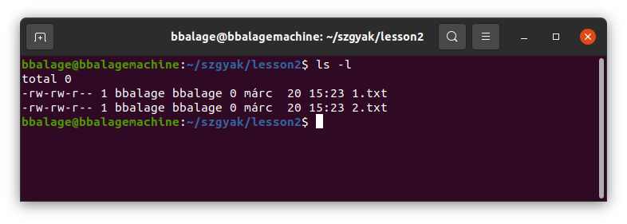
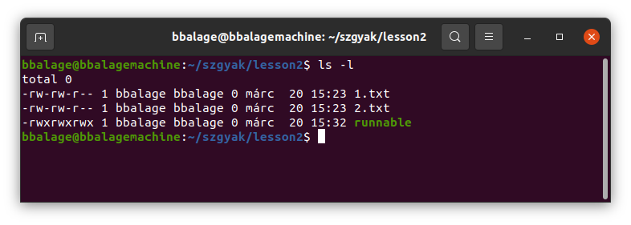
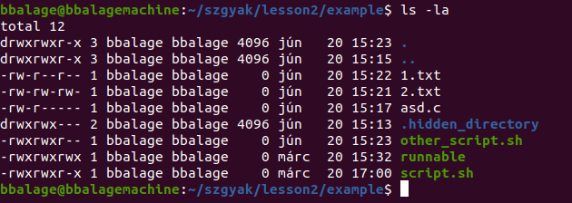
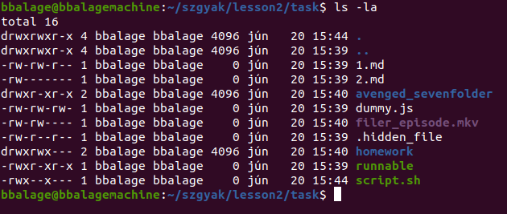

# 2. óra

**Előkészület:** Hozzunk létre egy külön mappát ennek a gyakorlatnak a feladataihoz,
és lépjünk bele (a mappába)! Hozzunk létre benne tetszőleges text fájlokat.

```bash
cd szgyak
mkdir lesson2
cd lesson2
touch 1.txt
touch 2.txt
```

Ezek után elkezdhetjük az új anyagot!

## Jogosultságok

Az előző órán megtanultuk, hogy hogyan lehet terminálban navigálni a fájlrendszerbe.
Nem néztük azonban meg, hogy milyen jogosultságok vannak, hogyan lehet ezeket megtekinteni,
hogyan tárolja őket a Linux, és hogyan tudjuk őket módosítani.

A jogosultságok megtekintése meglehetősen egyszerű, és ennek a módját már tanultuk. Adjuk ki
a következő parancsot a `lesson2` mappában.

```bash
ls -l
```

Eddig nem néztük meg jobban, hogy mit is ír ki pontosan az `ls` parancs az `-l` kapcsolóval
kombinálva. Az alábbi képen látható egy lehetséges output:



Ilyenkor a következő oszlopok jelennek meg.
1. Jogosultságok. Rövidesen tisztázzuk az értelmezését.
2. Tulajdonos. Általában egyezik azzal a felhasználóval, aki létrehozta a fájlt.
3. Csoport. Rövidesen erre is kitérünk bővebben.
4. Méret. Bájtokban megadva látjuk.
5. Utolsó módosítás ideje.
6. Név.

Térjünk rá ezekből a jogosultságok oszlopra!

### Jogosultságok egyszerű fájlokra
Unix alapú rendszeren háromféle jogosultságot különböztetünk meg:
- olvasási (**r**ead),
- írási (**w**rite),
- futtatási (e**x**ecute).

A jogosultságokat minden elemnél háromféle felhasználóra értelmezzük. Ezek a felhasználók:
- a tulajdonos,
- a tulajdonosi csoportban lévő felhasználók,
- mindenki más.

Ennek megfelelően egy fájlra 3x3 jog létezik, tehát 9. Tekintsük az alábbi képernyőképet:



A `runnable` nevű fájlt mindenkinek joga van írni, olvasni és futtatni. Ezt jelöli, hogy 
látható az `rwxrwxrwx` a fájl előtt. Ezzel szemben a két text fájlt csak a tulajdonosnak és 
a tulajdonosi csoporttagoknak tartozóknak van joguk írni, ellenben mindenkinek joga van olvasni.
Futtatni senkinek sincs joga a text fájlokat (nem is lenne értelme futtatni egy text fájlt).

Látható, hogy azok a jogok, amik nincsenek megadva '-' karakterrel (kötőjel) vannak jelölve.
Ami meg van adva, annak a megfelelő karaktere kiírásra kerül. Az első hármas `rwx` csoport a
tulajdonos jogait jelöli, a második a tulajdonos csoportjában lévőket, a harmadik mindenki mást.

Megjegyzendő, hogy a fájl törléséhez is írási jog kell.

### Jogosultságok számokként
Ahhoz, hogy meg tudjuk változtatni ezeket a jogosultságokat, először nézzük meg, hogy rendszer
hogyan reprezentálja őket!

A jogosultságokat az Unix rendszerekben hagyományosan számokkal jelölik. A számok képzése a 
következő:
- `r` = 4
- `w` = 2
- `x` = 1

A számok láthatóan kettő hatványai (második, első és nulladik hatványa). Ha ezeknek az összegét 
képezzük, akkor megkapjuk, hogy milyen jogok élnek a fájlra. Például, ha az `1.txt` fálj jogaiból 
indulunk ki, akkor a tulajdonos jogait a 6-os szám jelöli, mert `r + w` joga van, ami számokkal
`4 + 2 = 6`. Ezeket a számokat is ismételjük, tehát az adott fájl jogai 664, ugyanis a tulajdonos
és a csoporttagoknak jogát a hatos szám jelöli, míg a többiekét a 4-es, mert ők csak
olvashatják a fájlt.

Néhány példa kombináció:
- 755 = `rwxr-xr-x`: A tulajdonos mindent megtehet a fájllal, de a többiek nem írhatják.
- 640 = `rw-r-----`: A tulajdonos írhat és olvashat, a csoportba tartozók csak olvashatnak,
mindenki más nem tehet semmit a fájllal.
- 711 = `rwx--x--x`: A tulajdonos mindent megtehet, de mindenki egyéb csak futtathatja a fájlt.

A tulajdonosnak nem kell több jogosultsággal rendelkeznie, mint mindenki másnak, de így logikus.

Most, hogy tudjuk a jelöléseket, nézzük a változtatásokat!

### Jogosultságok megváltoztatása
A jogosultságok megváltoztatására a `chmod` parancsot használhatjuk. A parancs első paramétere 
az új jogosultságok számokkal, a második a fájl, amire meg akarjuk változtatni a jogosultságokat.
Például:

```bash
chmod 640 1.txt
# ezután nézzük meg:
ls -l
```

A fönti parancs után az 1.txt jogosultságai a következők lesznek: `rw-r-----`. Természetesen a 
parancsnak megadható bármilyen háromjegyű szám, amelyben nem szerepel 8-as vagy 9-es számjegy, de 
persze némelyik logikailag nincs sok értelme. Például miért adnánk meg 507-et? Ezzel a fájllal 
bárki bármit tehet, de a tulajdonosa nem írhatja, és a csoport is teljesen le van tiltva
róla. Ha átrendezzük, akkor már több értelme van: 750. Ettől függetlenül az 507 is megadható,
nem tiltja semmi.

A chmod parancsnak adhatunk a következőképpen is paramétert:

```bash
touch script.sh
# Edit the script
chmod +x script.sh
```

A fönti parancsoknál létrehoztunk egy `script.sh` nevű fájlt. Alapértelmezetten a `script.sh`
fájlon sincs futtatási jog, viszont mi később tudni fogjuk, hogy az `.sh` kiterjesztésű fájlokban
shell scripteket szoktunk tárolni, amelyeket esélyesen futtatni szeretnénk. Ehhez előbb írnunk is 
kell a fájlba egy programot (amelyet a fönti példában nem tettünk meg, csak kommentben), viszont 
jogunk attól még nincs a futtatásra. A `chmod +x script.sh` parancs mindenkinek megadja a futtatási
jogot a fájlhoz. Ha ennél finomabban akarjuk megadni, akkor vissza kell térnünk a számos jelöléshez.

### Mappa jogosultságok
Mappák esetében is értelmezettek a read-write-execute jogok, de mást jelentenek, mint fájlok esetén.
- **read:** Aki rendelkezik olvasási joggal, az listázhatja a mappa bejegyzéseit (a benne lévő fájlokat
és mappákat).
- **write:** Aki rendelkezik ezzel a joggal, az módosíthatja a mappa tartalmát.
- **execute:** Aki rendelkezik ezzel a joggal, az beléphet a mappába. Megjegyzendő, hogy ha nem léphetünk
be a mappába, akkor nem tudunk módosítani benne és nem tudjuk megfelelően listázni a bejegyzéseit sem.
Tehát a read és write jog az execute jog nélkül nem sok hasznot jelent nekünk.

## Csoportok
Minden fájlnak van egy tulajdonosi csoportja, amelyre a fönt olvasottaknak megfelelően kitüntetett
jogosultságok vonatkozhatnak. Az `ls -l` parancs kilistázza a fájlokat a tulajdonossal és a
csoporttal együtt.

A következő módon megnézhetjük, hogy az adott user melyik csoportokba tartozik:

```bash
groups username
# a username nevű felhasználó csoportjai kiírásra kerülnek
```

Minden fájlnak egy tulajdonosi csoportja van, de egy felhasználó több felhasználói csoportban lehet. 
Az Unixban vannak parancsok különböző csoportkezelési műveletekre. Mivel ez a tárgy nem az *Unix Rendszergazda*
tárgy, ezért ezekbe a parancsokba nem fogunk itt mélyebben belemenni. Az alábbi parancsokat felsoroljuk, de
legfeljebb minimális szükségünk lesz rájuk:
- `useradd` új felhasználót ad a rendszerhez.
- `groupadd` új csoportot ad a rendszerhez.
- `usermod -a -G groupname username` egy meglévő usert (username) egy meglévő csoporthoz (groupname) hozzáad.

A föntiek inkább rendszergazdai feladatok, de ritkán személyes gépen is hasznosak lehetnek kényelmi okokból.

Lényegesen gyakrabban kell használni a `chown` parancsot, amely egy fájl tulajdonjogának megváltoztatására
szolgál. Egyszerre lehet használni a tulajdonos felhasználó és a tulajdonos csoport megváltoztatására.
Ha csak a tulajdonost akarjuk megváltoztatni, akkor a következőképpen tehetjük:

```bash
chown newusername filename
```

Amennyiben a tulajdonosi csoportot is meg akarjuk változtatni, akkor az alábbi módon adjuk ki a parancsot:

```bash
chown username:groupname filename
```

Megjegyzendő, hogy a `chown` parancshoz szükséges a rendszergazdai jogosultság, így ezt
nem tudjuk kipróbálni, csak otthoni gépen, ahol rendelkezünk a rendszergazda jelszavával. 

## Példák
Az alábbi példán keresztül gyakoroljuk a jogosultságok beállítását!

### 1. példa

Hozzunk létre a `lesson2` mappán belül egy `example` mappát! Ezen a mappán belül hozzuk 
létre a megfelelő fájlokat a megfelelő jogosultságokkal,
hogy az `ls -l` parancs a következő kimenetet generálja (a tulajdonosokkal ne törődjünk,
mérettel, elérési, módosítási idővel ne törődjünk): 



A következő kóddal mindez kivitelezhető:

```bash
# Create folder and cd into it
mkdir example
cd example

# Create files and directories
touch 1.txt
touch 2.txt
touch asd.c
touch other_script.sh
touch runnable
touch script.sh
mkdir .hidden_directory

# Set the permissions
chmod 644 1.txt
chmod 666 2.txt
chmod 640 asd.c
chmod 770 .hidden_directory
chmod 774 other_script.sh
chmod 777 runnable
chmod 775 script.sh
```

## Összefoglalás
Az alábbi parancsokat tanultuk (csak az elsőt, a `chmod`-ot használtuk érdemben):
- `chmod` módosítja a fájlokra adott jogosultságokat
- `chown` módosítja egy fájl tulajdonosát (rendszergazdai jog kell a kiadásához)
- `groups` kiírja egy felhasználó mely csoportokba tartozik
- `useradd` új felhasználót ad a rendszerhez
- `groupadd` új csoportot ad a rendszerhez

## Feladatok
Önálló gyakorló feladatok.

### 1. feladat
Hozzon létre egy mappát a `szgyak/lesson2` mappában `task` néven! A mappában belül
hozza létre a megfelelő mappákat és fájlokat a megfelelő jogosultságokkal, hogy a 
mappán belül kiadott `ls -la` parancs az alábbi screenshoton látható eredményt
hozza! (ignorálja a fájloknak és mappáknak a jogosultsághoz és névhez nem kötődő
tulajdonságait, tehát módosítási dátumot, tulajdonost, stb.)


