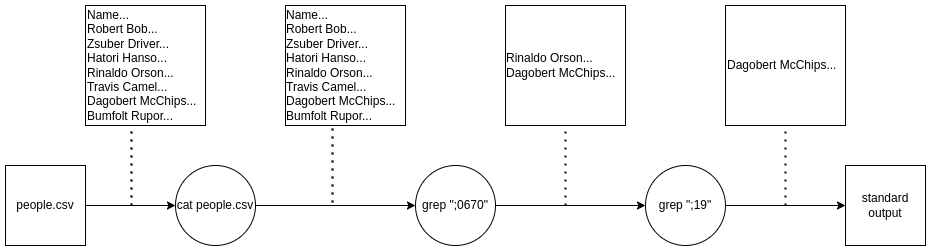

# 4. óra

Ezen az órán kicsit bővebben megnézzük a "csővezetékelést" Bashben,
és a reguláris kifejezésekbe is betekintünk.

Készítsük elő a munkánkat azzal, hogy létrehozunk egy `lesson4`
nevű nappát, benne pedig a `people.csv` fájlt az előző óráról ismert
tartalommal (legegyszerűbb tehát kopizni).

```bash
mkdir szgyak/lesson4
cd szgyak/lesson4
cp ../lesson3/people.csv ./ # bemásolja a fájlt az eredeti néven ebbe a directoryba 
```

## Csővezeték operátor láncolása
Hasonlóan a `&&` és `||` operátorokhoz, a `|` (pipeline) operátor is 
láncolható. Általánosan:

```bash
parancs1 | parancs2 | parancs3
```

Ha a `people.csv` fájlból ki akarjuk olvasni azokat az embereket,
akiknek 70-es a telefonszáma és az 1900-as években születtek,
akkor azt megtehetjük például így:

```bash
cat people.csv | grep ";0670" | grep ";19"
```

Egy ábrával szemléltetve ilyenkor a következő történik:



Tehát a `grep` parancs "megszűrte" a bemenetét, mielőtt a kimenetére
engedte. Azokat a parancsokat, amelyek így viselkednek, "szűrő"
parancsoknak nevezzük.

Nézzünk meg néhányat példákon keresztül!

### 1. példa
Írjuk ki a `people.csv` fájl utolsó három sorát!

```bash

```

### 2. példa
Írjuk ki a `people.csv` fájl első három sorát, fejléccel együtt!

```bash

```

### 3. példa
Írjuk ki a `people.csv` fájl utolsó olyan sorát, ahol a telefonszám
harmincas!

```bash

```

### 4. példa
Írjuk ki a `people.csv` fájl első három sorát, fejléc nélkül!

```bash

```

### 5. példa
Írjuk ki a `/dev` mappa első 10 fájlját vagy directory-ját, akkor 
is, ha azok rejtettek! Ne jelenjenek meg a `.` és `..` speciális
jegyzékek!

```bash

```

### 6. példa
Írjuk ki a `/dev` mappa utolsó 5 diskjét (most tekintsük
azokat a fájlokat disknek, amiknek a tulajdonos csoportja disk)!

```bash

```

### 7. példa
Írjuk ki a `people.csv` fájlból csak az emberek neveit!

```bash

```

### 14. példa

- Azokat a sorokat, ahol a személy keresztneve R-rel kezdődik.
- Azokat a sorokat, ahol a személy vezetékneve R-rel kezdődik.
- Az első 3 sort, a fejléccel együtt (a fejléc a Name;Birthdate;Phone;Skill sor).
- Az első 3 sort, a fejléc nélkül.


### Reguláris kifejezések
A reguláris kifejezések a *text matching* feladatához gyakran használt eszközök. A reguláris 
kifejezések egy strukturált megfogalmazása annak, hogy milyen szöveget szeretnénk megtalálni
egy másik szövegben. Egy rövid összefoglaló található a föntebb megjelölt forrásokban, de
a legbőségesebb tudástár ilyen téren az [internet](https://www.regular-expressions.info/).


Ezen az órán példakódok és utánuk feladatok lesznek. A példakódok a feladat megoldásában
való segítségre szolgálnak. Bizonyos feladatoknál hasznosak lehetnek.

## 1. Példakód csoport

Korábbi ismeretekből példakódok.

### 1.1. példa
Az alábbi script leszed egy fájlt az internetről, és kilistázza a tartalmát.

```bash
wget https://raw.githubusercontent.com/bbalage/BashExamples/master/assets/file1.txt
cat file1.txt
```

### 1.2. példa
Az alábbi script kitömöríti az `example.zip` fájlt, és a tartalmát egy `dirname` nevű
mappába helyezi.

```bash
unzip example.zip -d dirname
```

### 1.3. példa
Az alábbi script lefordít egy `hello.c` fájlnevű C fájlt, és a készült bináris parancsfájlt 
`hello` néven kiírja a fájlrendszerre. A `hello` programot ezután futtatja.

```bash
gcc hello.c -o hello # Create hello as a runnable
./hello # Run hello
```

### 1.4. példa
Az alábbi script lefuttat egy `rm` parancsot, és ha a parancs sikertelen volt, akkor hibaüzenetet
ír, majd maga is kilép hibával. Megjegyzem, hogy a `$?` a legutóbb lefuttatott parancs visszatérési
értékét adja, és a fele végrehajtott ellenőrzés bármilyen szabványkövető paranccsal működőképes
kell legyen.

```bash
rm -r non_existing_directory # -r is for recursive; if specified, rm deletes a directory with all its contents
if [ $? -ne 0 ]; then
    echo "There was an error!" 1>&2
    exit 1
fi
```

### 1.5. példa
Az alábbi script ellenőrzi, hogy van-e már `build` nevű mappa a futtatás helyén, és
ha nincs, akkor létrehozza azt.

```bash
if [ ! -d build ]; then
    mkdir build
fi
```

### 1.6. példa
Az alábbi script ellenőrzi, hogy egy beolvasott adat numerikus-e, ezen belül pozitív egész, és
hibát ír, ha nem.

```bash
read -p "Number: " num
re='^[0-9]+$'

if ! [[ $num =~ $re ]] ; then
    echo "error: Not a number" 1>&2;
    exit 1
fi
```

## 1. feladatcsoport
Néhány gyakori parancs együttes használata.

### 1.1. feladat
Az MVK Zrt. elérhetővé tesz egy szabványos GTFS adatbázist a fejlesztők számára, hogy a menetrendi 
adatokat a saját applikációikba tudják integrálni. Írjunk egy shell script fájlt, amely letölti ezt 
az adatbázist, és kilistázza belőle azokat az utakat, amelyek a Centrumból indulnak, vagy a Centrumba
mennek.

**Parancsok:**
wget, unzip (kitömörítésre), cat, grep

**Szükséges ellenőrzések:**
- Ha a letöltendő fájl már egyszer le volt töltve, akkor az újbóli letöltés előtt töröljük az előző 
verziót!
- Ha egy mappába már korábban ki lett tömörítve a letöltött állomány, akkor az újbóli kitömörítés
előtt szabaduljunk meg ennek a mappának a tartalmától!

**Megoldás:**
```bash
if [ -e gtfs.zip ]; then
    rm gtfs.zip
fi

if [ -d gtfs ]; then
    rm -r gtfs
fi

wget "https://gtfsapi.mvkzrt.hu/gtfs/gtfs.zip"
unzip gtfs.zip -d gtfs
cat gtfs/routes.txt | grep "Centrum"
```

### 1.2. feladat
Írjunk egy shell script fájlt, amely lefordít egy paraméterként megadott .c fájlt, ha az létezik és
nem üres (ha nem létezik vagy üres, akkor jelezzen hibát, és adjon hibaüzenetet)!
A lefordított, futtatható bináris állomány egy `build` nevű mappába kerüljön, mely jöjjön létre, ha 
még nem létezik!

Ha a fordítás sikeres, akkor futtassa le a kapott bináris állományt!

A C program legyen a következő:

```c
#include "stdio.h"

int main()
{
    printf("Hello World!\n");
}
```

**Parancsok:** gcc (C fordító)

**Megoldás:**

```bash
if [ $# -eq 0 ]; then
    echo "No input file specified." 1>&2
    exit 1
fi

if [ ! -s $1 ]; then
    echo "File does not exist or empty." 1>&2
    exit 1
fi

if [ ! -d build ]; then
    mkdir build
fi

gcc $1 -o build/run && ./build/run
```

## 2. Példakódcsoport
Ciklusokhoz tartozó példakódok.
További példakódok és bővebb magyarázatok találhatók az alábbi [pdfben](https://users.iit.uni-miskolc.hu/~toth130/arch/gyak/Gyak7.pdf).

### 2.1. példa
Az alábbi script kiírja 0-tól 10-ig a számokat, `for`, `while` és `until` ciklussal is!

```bash
# for ciklussal
for (( i = 0; i <= 10; i++)); do
    printf "$i "
done
echo

# while ciklussal
i=0
while [ $i -le 10 ]; do
    printf "$i "
    i=$((i + 1))
done
echo

# until ciklussal
i=0
until [ $i -gt 10 ]; do
    printf "$i "
    i=$((i + 1))
done
echo
```

### 2.2. példa
Az alábbi script felsorolja az összes argumentumot, amit a program kapott.

```bash
for i in $*; do
    echo $i
done
```

### 2.3. példa
Az alábbi script véletlenszámokat generál különböző intervallumokban, és kiírja őket.

```bash
echo $((RANDOM % 100)) # [0-99]
echo $((RANDOM % 101)) # [0-100]
echo $((RANDOM % 100 + 1)) # [1-100]
echo $((RANDOM % 50)) # [0-49]
echo $((RANDOM % 51 + 50)) # [50-100]
```

### 2.4 példa
Az alábbi script bekéri `N` értékét, és kiírja az első `N` Fibonacci számot, ahol nullát vesszük a
nulladik Fibonacci számnak. `N` legalább 2.

```bash
read -p "Please, give the valu of N (at least 2):" N

if [ N -lt 2 ]; then
    echo "N was too small." 1>&2
    exit 1
fi

f_before_prev=0
f_prev=1
echo "0: $f_before_prev"
echo "1: $f_prev"
for ((i = 2; i <= N; i++)); do
    f=$((f_prev + f_before_prev))
    echo "$i: $f"
    f_before_prev=$f_prev
    f_prev=$f
done
```

### 2.5. példa
Az alábbi script kilistázza a working directory-ban található fájlokat (és mappákat), és mindegyikhez
egy számot is rendel.

```bash
i=0
for name in $(ls); do
    echo "$i: $name"
    i=$((i+1))
done
```

## 2. feladatcsoport
Ciklusok használata.

### 2.1. feladat
Írjunk egy shell scriptet, ami bemeneti paraméterként egyetlen pozitív számot vár (hibát ír, ha nem
ezt kap). A program feladata, hogy kiírja, hogy a kapott szám prím-e.

**Megoldás:**
```bash
if [ $# -lt 1 ]; then 
    echo "No number provided as input." 1>&2
    exit 1
fi

num=$1
re='^[0-9]+$'
if ! [[ $num =~ $re ]] ; then
    echo "error: Not a positive number." 1>&2;
    exit 1
fi

if [ $num -le 1 ]; then
    echo "Not prime."
    exit 0
fi

square_root=$(echo "scale=0; sqrt($num)" | bc)

for ((i=2;i<=square_root;++i)); do
    if [ $((num % i)) -eq 0 ]; then
        echo "Not prime."
        exit 0
    fi
done

echo "Prime."
```

### 2.2. feladat
Írjunk egy shell scriptet, ami bemeneti paraméterként egy mappa nevét várja. Ha a mappa létezik,
akkor minden benne lévő .txt fájl tartalmát soronként megfordítja, és kiírja egy másik fájlba.

**Megjegyzés:** A `rev` parancsot érdemes használni.

**Megoldás:**

```bash
if [ $# -lt 1 ]; then
    echo "No input argument provided!" 1>&2
    exit 1
elif [ ! -d $1 ]; then
    echo "Directory does not exist."
    exit 1
fi

for filename in $(ls $1 | grep ".txt$"); do
    cat "$1/$filename" | rev > "$1/$filename.out"
done
```

## 3. Példakódcsoport
Tömbök használata és létrehozás.

### 3.1. példakód
Létrehozunk tömbelemeket, és kiíratjuk őket. Ezt megcsináljuk többféleképpen.

```bash
declare -a arr
arr[0]=12
arr[1]=3
arr[2]=6

for element in ${arr[*]}; do
    echo $element
done
```

Másképpen:

```bash
declare -a arr=(12 3 6)

for ((i=0;i<${#arr[*]};++i)); do # ${#arr[*]} megadja nekünk a tömbelemek számát
    echo ${arr[i]}
done
```

Ezek kombinálhatók is.

### 3.2. példakód
Feltöltünk egy 10 elemű tömböt véletlen számokkal, majd végigmegyünk a számokon és megnöveljük
őket 1-gyel.

```bash
declare -a arr

for ((i=0; i<10; ++i)); do
    arr[$i]=$((RANDOM % 100)) # random number from 0 to 99
    printf "${arr[$i]} "
done
echo

for ((i=0; i<10; ++i)); do
    arr[$i]=$((arr[i] + 1))
done

for element in ${arr[*]}; do
    printf "$element "
done
echo
```

## 3. feladatcsoport
Tömbös feladatok.

### 3.1. feladat
Hozzunk létre egy N elemű tömböt, ahol N-t `read` paranccsal kérjük be, és ellenőrizzük, hogy 
pozitív egész szám (hibával visszatérünk, ha nem az). Töltsük fel véletlen számokkal a tömböt,
ahol a véletlen számok az \[1-100\] intervallumból kerülnek ki! Ezután végezzük el a következő
műveleteket a tömbre:
- Minimum elem kiíratása (hányadik elem és mi az értéke).
- Maximum elem kiíratása (hányadik elem és mi az értéke).
- Írjuk ki az elemek összegét.
- Írjuk ki az elemek átlagát.

**Megoldás:**

```bash
read -p "Please type the size of the array!" N

re='^[0-9]+$'
if ! [[ $N =~ $re ]] ; then
    echo "error: Not a positive number." 1>&2;
    exit 1
fi

if [ $N -eq 0 ]; then
    echo "error: Array size is 0." 1>&2
    exit 1
fi

declare -a arr

for ((i=0; i<N; ++i)); do
    arr[$i]=$((RANDOM % 100 + 1)) # random number from 1 to 100
    printf "${arr[$i]} "
done
echo

sum=arr[0]
mini=0
maxi=0
for ((i=1; i<N; ++i)); do
    if [ ${arr[$i]} -gt ${arr[$maxi]} ]; then
        maxi=$i
    fi
    if [ ${arr[$i]} -lt ${arr[$mini]} ]; then
        mini=$i
    fi
    sum=$((sum + arr[i]))
done

echo "Minimum: $mini - ${arr[$mini]}."
echo "Maximum: $maxi - ${arr[$maxi]}."
echo "Sum: $sum."
avg=$(echo "scale=4; $sum / $N" | bc)
echo "Average: $avg."
```