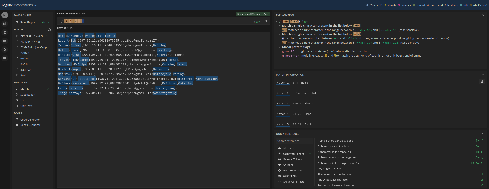

# 4. óra

Ezen az órán kicsit bővebben megnézzük a "csővezetékelést" Bashben,
és a reguláris kifejezésekbe is betekintünk.

Készítsük elő a munkánkat azzal, hogy létrehozunk egy `lesson4`
nevű nappát, benne pedig a `people.csv` fájlt az előző óráról ismert
tartalommal (legegyszerűbb tehát kopizni).

```bash
mkdir szgyak/lesson4
cd szgyak/lesson4
cp ../lesson3/people.csv ./ # bemásolja a fájlt az eredeti néven ebbe a directoryba 
```

## Csővezeték operátor láncolása
Hasonlóan a `&&` és `||` operátorokhoz, a `|` (pipeline) operátor is 
láncolható. Általánosan:

```bash
parancs1 | parancs2 | parancs3
```

Ha a `people.csv` fájlból ki akarjuk olvasni azokat az embereket,
akiknek 70-es a telefonszáma és az 1900-as években születtek,
akkor azt megtehetjük például így:

```bash
cat people.csv | grep ";0670" | grep ";19"
```

Egy ábrával szemléltetve ilyenkor a következő történik:


Tehát a `grep` parancs "megszűrte" a bemenetét, mielőtt a kimenetére
engedte. Azokat a parancsokat, amelyek így viselkednek, "filter"-eknek
(vagy szűrő parancsoknak) nevezzük. **Filter tehát az a parancs, ami a
bemenetről olvas, csinál valamit, majd kiírja az eredményt.** Ezekből néhány:
- `head` az első x sort írja ki a kimenetre.
- `tail` az utolsó x sort írja ki a kimenetre.
- `sort` rendezi a bemenetet, és kiírja a kimenetre.
- `grep` ismerjük.
- `wc` megszámolja a szavak, karakterek, sorok számát, és kiírja a kimenetre.
- `rev` soronként fordítva írja ki a bemenetet.
- `uniq` rendezett adatokban vizsgál számosságot és egyediséget (például megnézi,
hogy egy sor hányszor szerepel).
- `cut` oszlopokat vág ki az adatból.
- `tr` karaktereket cserél ki az adatban.

Nézzünk meg néhányat példákon keresztül!

### 1. példa
Írjuk ki a `people.csv` fájl utolsó három sorát!

```bash
cat people.csv | tail --lines=3
# A következő parancs ugyanezt csinálja (csak nem kell kiírni, hogy '--lines')
cat people.csv | tail -3
```

A `tail` parancs ugyanúgy szűrőként működik, mint a `grep`, csak más műveletet
hajt végre. A parancs neve után megadott számnak megfelelő mennyiségű sort írja
ki a fájl végéről.

### 2. példa
Írjuk ki a `people.csv` fájl első három sorát, fejléccel együtt!

```bash
cat people.csv | head --lines=3
```

A `head` ugyanúgy működik, mint a `tail`, csak nem az utolsó, hanem az első sorokat
írja ki.

### 3. példa
Írjuk ki a `people.csv` fájl utolsó olyan sorát, ahol a telefonszám
harmincas!

```bash
cat people.csv | grep ";0630" | tail -1
# Vagy:
cat people.csv | grep ";0630" | tail --lines=1
```

A fönti parancs az eddigiek alapján könnyen érthető, ha tudjuk, hogy a csővezetéket
sok parancson keresztül is láncolhatjuk.

### 4. példa
Írjuk ki a `people.csv` fájl összes sorát, kivéve az utolsó ötöt!

```bash
cat people.csv | head --lines=-4
# Vagy a következő is ugyanezt csinálja
cat people.csv | head
```

Ha a `--lines` után negatív számot adunk meg, akkor nem az első *n* darabot írja ki,
hanem az utolsó *n* darabot **nem** írja ki. Hasonló a `tail` működése is, egy kis 
csavarral, amit meglátunk a következő példában.

### 5. példa
Írjuk ki a `people.csv` fájl első három sorát, fejléc nélkül!

```bash
cat people.csv | tail --lines=+2 | head --lines=3
# Vagy rövidebben:
cat people.csv | tail +2 | head -3
```

Ebben az esetben a `tail` az *n*-edik sornál kezdi a kiírást, ahol a számot `+` jellel
adjuk meg (nem minusszal, mint a `head`-nél).

### 6. példa
Írjuk ki a `/dev` mappa első 10 fájlját vagy directory-ját, akkor 
is, ha azok rejtettek! Ne jelenjenek meg a `.` és `..` speciális
jegyzékek!

```bash
ls -la /dev | tail +4 | head -10
```

Itt az `ls -la` parancs első három sorát vágtuk le (ami a *total number of disk 
blocks* sor és a két speciális directory sora), majd a maradékból meghagytuk az első
10-et.

Ez a példa közelebb áll ahhoz, amire gyakorlatban is használjuk a Bash nyelvet.
A csv fájlon könnyű megmutatni ezeknek a parancsoknak a működését, de a gyakorlatban
nem csak fájlok tartalmán, hanem parancsok kimenetén is dolgozunk. Ezek akkor szoktak
előjönni, mikor valami command line (parancssori) eszközt használunk, ami listáz
nekünk valamit. Ilyeneket jelenleg nem igazán ismerünk, és nem is fogunk, amíg 
valami valós vagy egyetemi projektben nem jönnek szembe velünk.

Ettől függetlenül megemlíteném, hogy például a `docker` eszközt. Ez virtuális 
gépeket kezel, és megfelelő kapcsolókkal kiírja nekünk a jelenleg működő virtuális 
gépeket, a nevükkel és az azonosítójukkal. Ekkor a `grep` parancs jól jön nekünk,
hogy a sok virtuális gép közül megtaláljuk a megfelelő nevűt. Ha nagyon command line
mágusok vagyunk, akkor a név mellé az id-t is kiszedhetjük bash segítségével, és
akár a gépet is leállíthatjuk. Ez bajlódós keresés, kijelölés, kopizás és beillesztés
lenne, de ha csinálunk rá magunknak egy scriptet, akkor egyetlen parancsból megoldható.

**A bash egyik nagy előnye abban van, hogy gyakran ismételt command line parancsokat 
automatizálhatunk.**

### 7. példa
Írjuk ki a `/dev` mappa utolsó 5 diskjét (most tekintsük
azokat a fájlokat disknek, amiknek a tulajdonos csoportja disk)!

```bash
ls -la /dev | grep " disk " | tail -5
```

### 8. példa
Írjuk ki a `people.csv` fájlból csak az emberek neveit (a fejléc nélkül)!

```bash
cat people.csv | tail +2 | cut --field=1 --delimiter=';'
# Vagy ugyanez rövidebben
cat people.csv | tail +2 | cut -f 1 -d ';'
```

A fönti parancs utolsó eleme magyarázatra szorul, tehát a `cut` parancs.
Ez egy oszlopokból álló szövegből kiolvassa a megfelelő oszlopokat. Egy 
oszlop lehet bájt vagy karakter méretű is, de nekünk most *mezőkre* van
szükségünk. A `--fields=1` kapcsoló megmondja, hogy hányadik mezőt
szeretnénk kiolvasni a bemeneti szövegből. A mezőket viszont a fájlon belül
el kell választani valamivel, amit általában *delimiter* néven ismerünk
a szaknyelvben. A `--delimiter=';'` kapcsoló megmondja, hogy milyen karakterek
adják az oszlophatárokat a bemeneti szövegben (esetünkben a pontosvessző).

### 9. példa
Írjuk ki a `people.csv` fájlból csak a telefonszámokat, és azokból is csak az 
első 20-ast!

```bash
cat people.csv | grep ";0620" | cut -f 3 -d ';' | head -1
```

### 10. példa
Írjuk ki a `people.csv` fájlból az emberek neveit betűrendben (csak a neveket).

```bash
cat people.csv | tail +2 | cut -f 1 -d ';' | sort
```

### 11. példa 
Írjuk ki a `people.csv` fájlból a születési hónapokat (csak a hónapokat)!

```bash
cat people.csv | cut -f 2 -d ';' | cut -f 2 -d '.'
```

Ezen a ponton kezdhetjük érezni, hogy elég messzire lehet menni ezeknek
a parancsoknak a kombinálásával. Sok parancs van, saját kapcsolókkal rendelkeznek,
és az eddigiekhez hasonlóan működnek. További parancsok megismerése és bonyolítás 
helyett térjünk át a reguláris kifejezésekre, amelyek szintén hasznosak lesznek
nekünk!

## Reguláris kifejezések
Az egyetemen egyszer a következőt mondta nekem az egyik tanár: "Az informatikában a két
legnehezebb dolog a caching és a reguláris kifejezések."

A reguláris kifejezéseket a *text matching* feladatához használják. **Egy reguláris
kifejezés egy minta, aminek ismeretében egy "reguláris kifejezés motor" 
egyértelműen meg tudja állapítani, hogy egy adott szövegre illeszkedik-e a kifejezés.**
Példa alapján érthetőbb: az alábbiak reguláris kifejezések, mellettük pedig azok, amikre
illeszkednek:

- `[0-9]{3}`: minden három hosszúságú számsorra illeszkedik.
- `^[A-Z][a-z]+`: minden nagybetűvel kezdődő szóra illeszkedik.

A továbbiakban megismerjük néhány építőelemét a reguláris kifejezéseknek.
Egy rövid összefoglalót mutatok be ebben a jegyzetben, de ennél
sokkal bőségesebb a téma, és az [internet](https://www.regular-expressions.info/)
rengeteg információt tartalmaz vele kapcsolatban. A reguláris kifejezéseket széles körben
használják, például egy weboldal formjának validálásakor (megmondják vele, hogy a 
szöveges mező milyen felépítésű szöveget tartalmazhat), vagy épp keresésekkor 
(megmondják vele, hogy milyen felépítésű szöveget keresnek). Hasznos, de bonyolult téma,
és nem fogunk nagyon elmélyülni benne.

Továbbra is a `people.csv` fájl tartalmán fogunk gyakorolni, de javaslom, hogy most az
egyszer hagyjuk itt egy időre a terminált, mert csak véget nem érő szenvedést fog okozni
nekünk.

Egy utolsó dologra azonban még rávilágítanék a Bash parancsokkal kapcsolatban:
láttuk, hogy az órán vegyesen használtam a kétféle idézőjelet, az egyszerest
(`'`) és a kétszerest (`"`). Ennek gyakorlati jelentősége is lesz innentől, ugyanis az
egyszeres idézőjel **csak szöveget** tartalmaz, míg a kétszeres **tartalmazhat értelmezendő
változókat**. Ezt a jövő órán bővebben látni fogjuk, egyelőre azonban elégedjünk meg
azzal, hogy **a reguláris kifejezéseket érdemes egyszeres idézőjelek közé írni**!

Adjunk új tartalmat a `people.csv` fájlnak, hogy bonyolultabb legyen a feladat, és indokolt
legyen a reguláris kifejezések használata! Az új tartalom:

```
Name;Birthdate;Phone;Email;Skill
Robert Bob;1997.09.12.;06201975555;bob2bob@gmail.com;IT
Zsuber Driver;1988.10.11.;06404445555;uber@gmail.com;Driving
Hatori Hanso;1966.01.11.;063012345;jean'dark@gmail.com;Smithing
Rinaldo Orson;2001.05.24.;06709330000;D&D@gmail.com;IT,Weight lifting
Travis Rick Camel;1970.10.01.;06301717171;mummy@citromail.hu;Horses
Dagobert McChips;1956.08.31.;067001111;clap.clapgmail.com;Cooking,Catery
Bumfolt Rupor;1967.09.11.;06201112233;HP123@mg.mh.hu;Marketing
Mad Marx;1965.09.11.;06301442233;money.bad@gmail.com;Motorcycle Riding
Borland Ci Rattleneck;1980.11.02;+36304225555;teller@citromail.hu;Bottleneck Construction
Baileys Margareti;1999.12.09;06209876543;b1gdr1nk@HOND.hu;Drinking,Catering
Larry Lipstick;1988.07.22;+36206547382;baby@gmail.com;Hairstyling
Inigo Montoya;1977.04.11;+367065682;pr3pare@gmail.to;Swordfighting
```

A https://regex101.com/ weboldalon van lehetőség interaktívan és viszonylag vizuálisan 
kipróbálni a reguláris kifejezéseket. Az alábbi screenshot illusztrálja, hogy mit kell 
látnunk a weboldalon. Másoljuk be a `people.csv` tartalmát oda, ahol a képen is látható
(a legnagyobb textboxba középen).



A jobb jobb felső sarokban angol nyelvű magyarázatok láthatók a beírt kifejezések 
jelentésére. Középen felülre tudunk beírni reguláris kifejezéseket, amikkel keresünk
a szövegben.
A jobb alsó sarokban található pár rövid emlékeztető, hogy mik a leggyakoribb reguláris 
kifejezések. Néhányat felsorolok itt, aztán példákon keresztül nézzük meg őket!

- A `.` bármely 1 db karakterre illeszkedik.
- A `?` karakter megmondja, hogy az előző karakter 1 vagy 0 alkalommal fordulhat elő
(tehát `blabla?` kifejezés illeszkedik `blabla` vagy `blabl` szövegekre).
- A `*` karakter megmondja, hogy az előző karakter akárhányszor előfordulhat, akár 0-szor
is (tehát `blabla*` kifejezés illeszkedik `blabla`, `blablaaaaaaaa` vagy `blabl` szövegekre
is).
- A `+` jel az előző karakter 1 vagy többszöri ismétlődését jelenti (tehát `blabla+`
kifejezés illeszkedik `blabla` vagy `blablaaaaa` szövegekre is, de **nem** illeszkedik 
`blabl` szövegre).
- A `[]` szögletes zárójeleken belül megadott karakterekre (például `[abc]`) vagy 
karakterintervallumokra (például `[a-z]`) illeszkedik, de csak egyre.
- A `[^]` szögletes zárójeleken belül megadott karakterekre **nem** illeszkedik
(az előző negálása), csak bármelyik másik egyetlen karakterre.
- A `{,}` kapcsos zárójeleken belül számszerűen megadható, hogy az előző karakterekből
mennyi forduljon elő. Például `{2,4}` azt jelenti, hogy minimum 2, de maximum 4 karakterre 
fog illeszkedni. `{N,}` jel esetén N vagy több karakterre illeszkedik. `{N}` esetén 
pontosan N karakterre illeszkedik. Megjegyzendő, hogy a `?`, `*`, `+` karakterek 
megadhatók kapcsos zárójel intervallumokkal is, a következőképpen: `{0,1}` = `?`, `{0,}` = `*`,
`{1,}` = `+`.
- A `^` karakter a sor elejére illeszkedik.
- A `$` jel a sor végére illeszkedik.

Ezek a leggyakoribb használt reguláris kifejezés építőelemek. Ebben a kurzusban nem lesz másra
szükség.

A reguláris kifejezések a `grep` paranccsal fogjuk használni. Ahhoz, hogy a `grep` parancs 
reguláris kifejezéseket értelmezzen, meg kell neki adni az `-E` kapcsolót (mint `Expression`),
majd a reguláris kifejezést javasoltan egyszeres idézőjelek között. Mielőtt beadjuk a
`grep` parancsnak a kifejezést, győződjünk meg róla a fönti weboldalon, hogy helyesen adtuk 
meg a kifejezésünket!

### 12. példa
Írjuk ki a `people.csv` fájlból azokat az embereket, akiknek R-rel kezdődik a keresztneve!

```bash
cat people.csv | grep -E '^R'
```

A `^` jel a sor elejét jelöli ki nekünk, tehát arra kerestünk rá, hogy melyik sor kezdődik R-rel.

### 13. példa
Írjuk ki a `people.csv` fájlból azokat az embereket, akiknek R-rel kezdődik a vezetékneve!

```bash
cat people.csv | grep -E '^[a-zA-Z ]+R[a-z]+;'
```

A fönti kifejezés illeszkedik minden olyan nagy R betűre, ami az első pontosvessző előtti
szó elején van, és csak betűk és szóközök előzik meg.

### 14. példa
Írjuk ki a `people.csv` fájlból azokat az embereket, akiknek legalább két skillje van!

```bash
cat people.csv | grep -E ',[a-zA-Z ]+$'
```

Arra kerestünk rá, hogy legyen vessző a sor végi szavak előtt.

### 15. példa
Írjuk ki a `people.csv` fájlból azokat az embereket, akiknek három neve van!

```bash
cat people.csv | grep -E '^[a-zA-Z]+ [a-zA-Z]+ [a-zA-Z]+;'
```

### 16. példa
Írjuk ki a `people.csv` fájlból azokat az embereket, akiknek valid az email címe!
(valid email cím legyen most az, aminek a felhasználónevében csak betű, szám és `.` 
karakter van, amiket `@` követ, majd kisbetűkből álló csoportnév, amitől `.` választja
el a záró, minimum 2, maximum 4 karakteres jelölőt; a felhasználónév minimum 3, maximum 100,
a csoportnév minimum 3, maximum 20 karakter legyen)

```bash
cat people.csv | grep -E ';[0-zA-Z0-9.]{3,100}@[a-z]{3,20}\.[a-z]{2,4};'
```

A fönti szövegben felhívnám a figyelmet a *backslash* karakter (`\`) használatára a `.`
karakter előtt. A `.` karakternek alapból jelentése van, ezért ha azt egyszerű karakterként
akarjuk használni, be kell írnunk elé egy *backslash* karaktert. Ugyanez igaz a többi speciális
karakterre is (`?` `+` `{` `}` `\` stb.)

## Megjegyzések
A korábbiakban a `cat` parancsot használtuk egy fájl kilistázására. Ez olyan szempontból
jó volt, hogy megtanultuk a parancsot és a csővezetékelést is szemléltette. A fönti példákban
viszont valójában elhagyható.
A `grep` parancsnak utolsó paraméterébe beírható a fájl neve, amiben keresni akarunk.
Ugyanez igaz a többi megtekintett szűrő parancsra is. Például valid a következő:

```bash
head -1 people.csv
```

Ezzel a módszerrel viszont nem lehet például az `ls` parancs tartalmán dolgozni
(bár a későbbiekben fogunk ciklust írni rá, hogy végigiteráljunk egy directory tartalmán).
Tehát a következő nem fog működni:

```bash
head -1 ls
```

## Feladatok

Tekintsünk néhány önálló gyakorló feladatot! A `people.csv` fájl tartalma az új,
frissített tartalom legyen!

### 1. feladat
Írjuk ki a nevük szerint betűrendben azokat, akiknek egyetlen Skillje van!

### 2. feladat
Írjuk ki azoknak a nevét és a telefonszámát, akiknek az egyik neve o-val végződik!

### 3. feladat
Írjuk ki azoknak az embereknek a keresztnevét, akiknek a telefonszáma +36-tal kezdődik
és valid (9 szám követi a +36-ot, és vagy 20-as, vagy 30-as, vagy 70-es)!

### 4. feladat
Írjuk ki azoknak az embereknek a vezetéknevét, akiknek a telefonszáma 06-tal kezdődik
és valid!

### 5. feladat
Írjuk ki azoknak az embereknek a nevét, akik páros napon születtek!